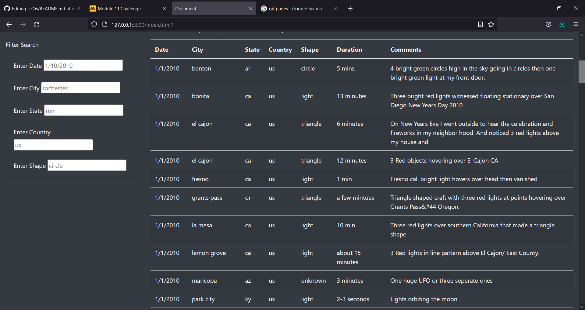
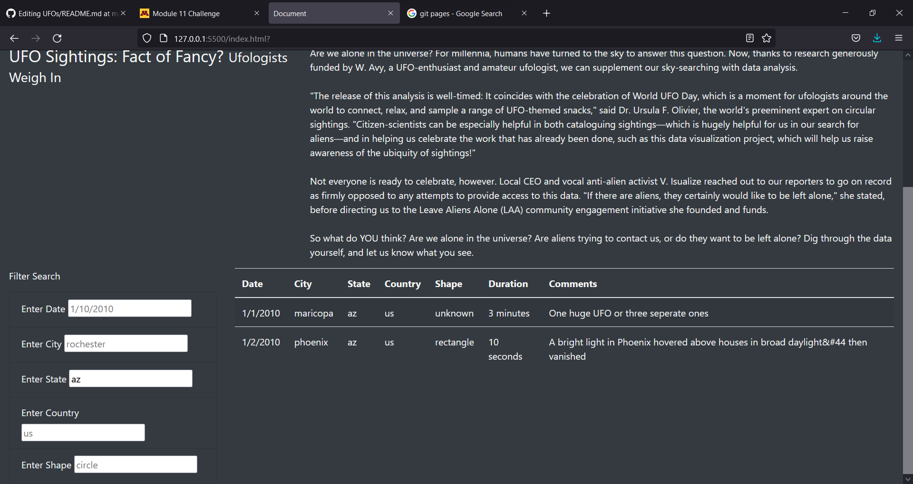

# UFOs

## Overview
The purpose of this project was to provide practice using modern JS features such as D3 to quickly build and filter tables, and to also provide an introduction to Git Pages.

## Results
The resulting web page is a table of UFO sightings with a variety of filters the user can choose to use. When being used currently the user has to keep in mind to only use lowercase to search, and to not mispell any search terms. Also while searching for something they must be ready to put in the whole search term before results are shown.

### Unfiltered Table

### Mid-Search Table

### Filtered Table

## Summary
The above images in the results highlight the biggest issue with this project - usability. Currently if you make any spelling mistakes while searching, use the wrong capitalization, or any other issue the program will fail to filter as intended. My first reccomendation to fix this is to use partial matching of strings while searching, for example while a user is searching for a city it will dynamically update with cities matching the spelling so far. My second reccomendation would be to add search reccomendations while typing, along with a user friendly calendar for filtering by date.
